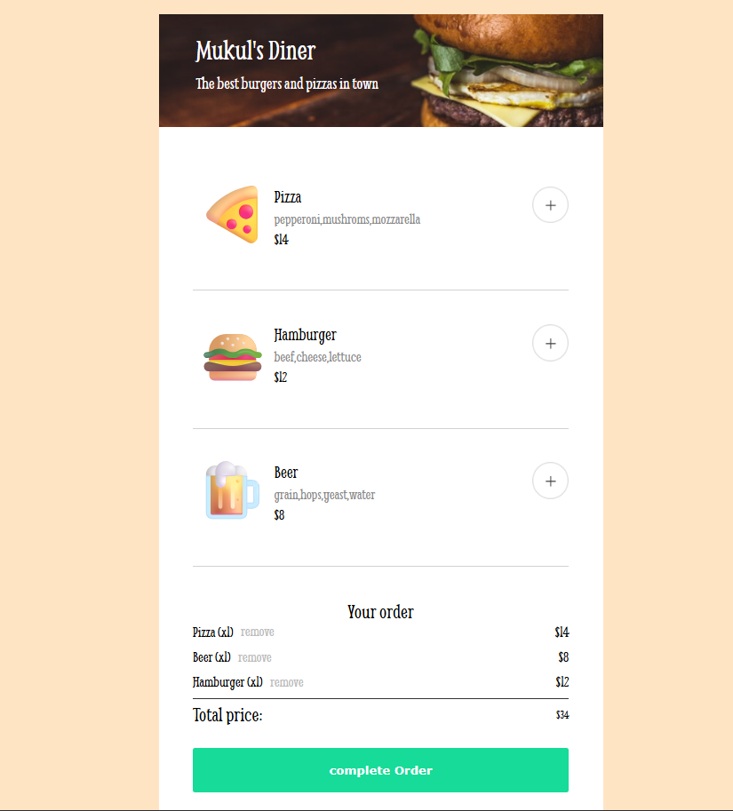
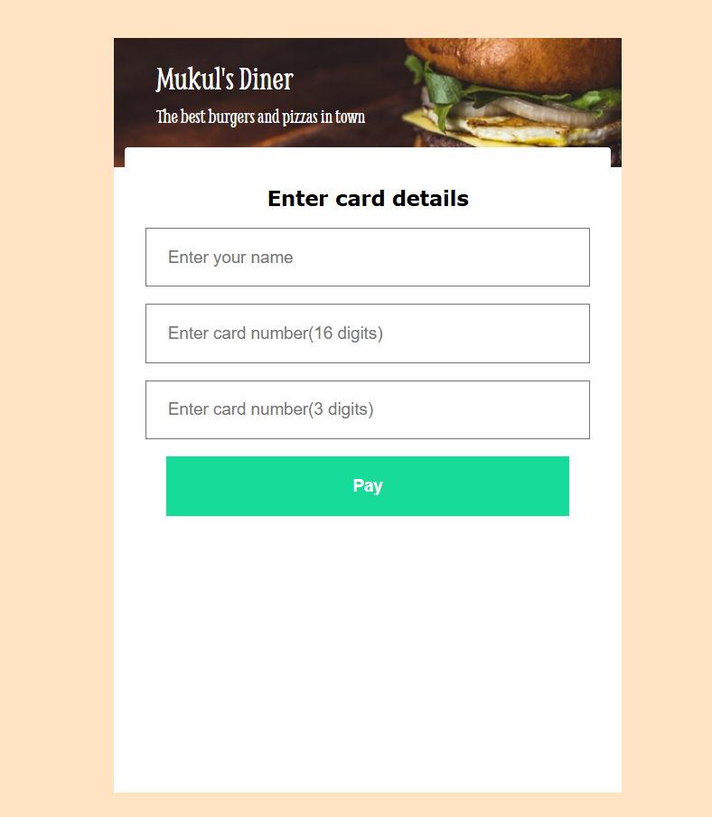
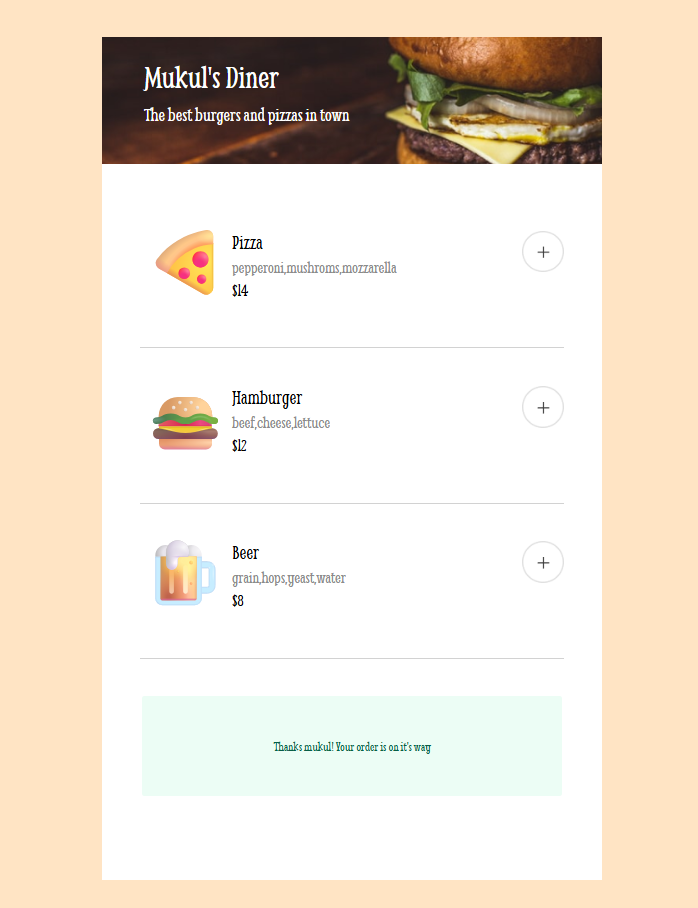

# RestaurantOrderingApp

A modern, interactive web-based ordering system for **Mukul's Diner** that allows customers to browse menu items, add/remove items from their cart, and complete their order with payment details.

## 🌐 Live Demo

**[Visit the live application](https://restaurantorderingappmk.netlify.app/)**

## 📸 Preview

### 1. Pre-Checkout State


### 2. Checkout & Payment Modal


### 3. Payment Modal Entry


### 4. Order Complete


## 🍔 Features

- **Interactive Menu Display** - Browse available menu items with emoji icons and prices
- **Add to Cart** - Click the "+" button to add items to your order
- **Remove from Cart** - Easily remove items from your cart with the "-" button
- **Order Summary** - View all items in your order with quantities and prices
- **Payment Modal** - Secure payment form to complete your order
- **Order Confirmation** - Personalized thank you message after successful order
- **Responsive Design** - Works seamlessly on desktop and mobile devices

## 📋 Menu Items

Current menu includes:
- 🍕 **Pizza** - $14 (pepperoni, mushrooms, mozzarella)
- 🍔 **Hamburger** - $12 (beef, cheese, lettuce)
- 🍺 **Beer** - $8 (grain, hops, yeast, water)

## 🏗️ Project Structure

```
RestaurantOrderingApp/
├── index.html          # Main HTML structure
├── index.css           # Styling and layout
├── index.js            # JavaScript functionality and event handling
├── data.js             # Menu data and export
├── README.md           # This file
└── images/             # Image assets
```

## 🚀 How to Use

1. **Open the App** - Open `index.html` in your web browser
2. **Browse the Menu** - View the available items displayed on the page
3. **Add Items** - Click the "+" button next to any menu item to add it to your order
4. **View Your Order** - Your selected items appear in the "Your order" section on the right
5. **Remove Items** - Click the "-" button if you want to remove any items
6. **Complete Order** - Click "Complete Order" when ready to proceed
7. **Enter Payment Details** - Fill in your name, card number, and CVV
8. **Confirm** - Submit the form to complete your order and see the confirmation message

## 💻 Technologies Used

- **HTML5** - Semantic markup and structure
- **CSS3** - Modern styling and responsive layout
- **JavaScript (ES6)** - Dynamic functionality with event listeners and DOM manipulation
- **Google Fonts** - Custom fonts (Smythe) for branding

## 🎨 Key Functions

| Function | Purpose |
|----------|---------|
| `handleAddBtnClick()` | Adds selected menu item to the order array |
| `handleRemoveBtnClick()` | Removes item from the order array |
| `submitForm()` | Processes payment form and displays confirmation |
| `renderMenu()` | Dynamically displays menu items on the page |
| `renderOrderDetails()` | Updates the order summary in real-time |

## 📝 Requirements

- A modern web browser (Chrome, Firefox, Safari, Edge)
- No dependencies or external packages required
- Pure vanilla JavaScript implementation

## 🛠️ Installation

1. Clone or download the repository
2. Navigate to the project folder
3. Open `index.html` in your web browser
4. Start ordering!

## 📝 Notes

- The payment form is for demonstration purposes
- All pricing and menu items can be easily modified in `data.js`
- The app uses ES6 modules for better code organization

---

Enjoy your meal! 🍽️
